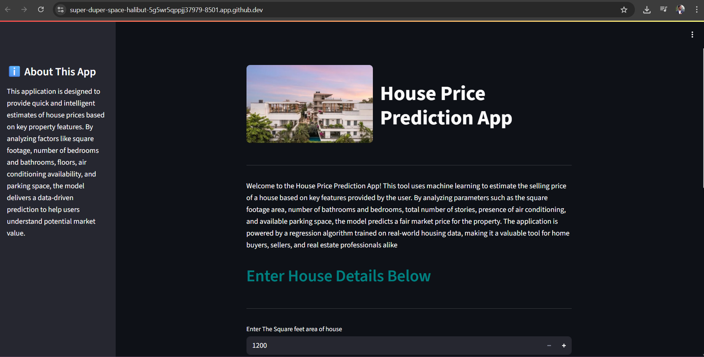

# 🏠 House Price Prediction App

A simple and interactive Streamlit web application that predicts house prices based on key property features like square footage, number of bedrooms and bathrooms, number of stories, air conditioning, and parking space.

## 📌 Overview

This application allows users to input various features of a house and get an estimated price instantly. It uses a machine learning model trained on a real estate dataset to make predictions. The user-friendly interface ensures an intuitive experience even for non-technical users.

## 🔧 Features

- Input fields for:
  - Total area (in square feet)
  - Number of bedrooms
  - Number of bathrooms
  - Number of stories
  - Parking space
  - Air conditioning (Yes/No)
- Real-time price prediction
- Clean UI with branding elements and visual appeal
- Built with Streamlit and Ridge Regression

## 🛠️ Tech Stack

- **Python**
- **Pandas, NumPy, Scikit-learn** (for model and preprocessing)
- **Streamlit** (for web interface)

## 🎯 Purpose

This project was created to apply machine learning concepts and build a hands-on end-to-end ML app. It demonstrates the complete cycle—from data processing and modeling to frontend deployment—while keeping the interface simple and visually appealing.

## 📸 Screenshot

 <!-- Replace with your actual screenshot file -->

## 📁 Folder Structure
.
├── dataset/
├── images/
├── model/
├── notebook/
├── app.py
└── README.md
